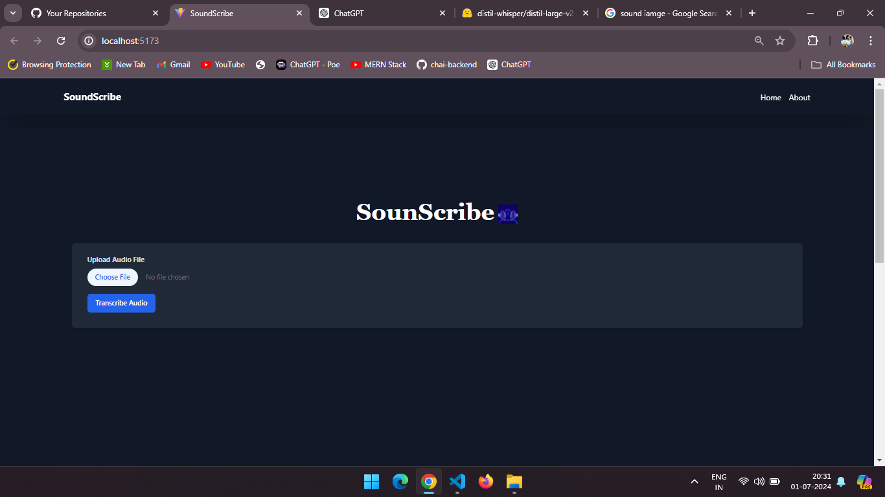
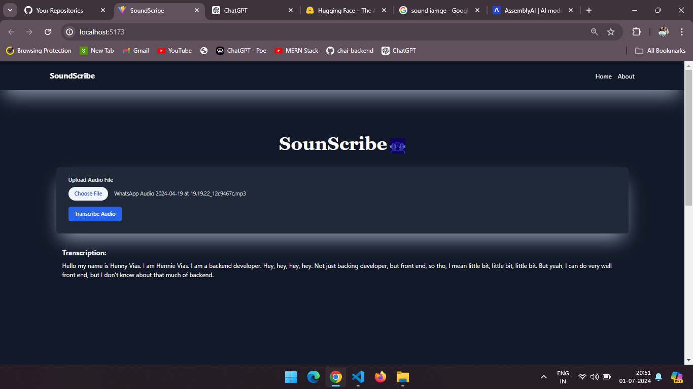
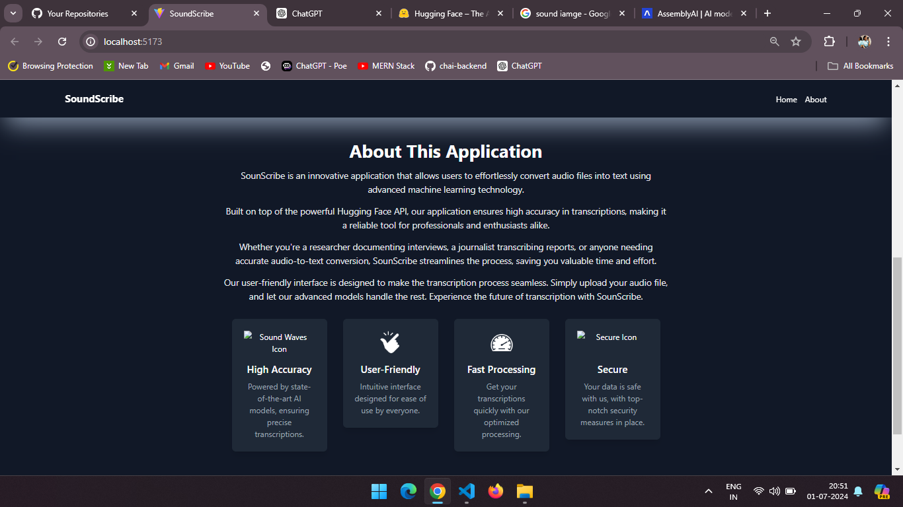

---

# SoundScribe 🎙️✍️

**Transform Audio into Text with Ease!**

---

### Welcome to SoundScribe!
SoundScribe is a powerful, AI-driven audio-to-text transcription tool designed to convert speech into accurate, readable text effortlessly. Whether you’re a journalist, student, researcher, or just someone who needs to transcribe audio regularly, SoundScribe is here to make your life easier.

---

### ✨ Features
- **High Accuracy**: Leverages advanced speech recognition technology to deliver highly accurate transcriptions.
- **Multiple Formats**: Supports a variety of audio formats including MP3, WAV, and more.
- **Real-Time Transcription**: Get instant transcriptions as you speak.
- **Custom Dictionaries**: Add specialized terms and names to improve recognition accuracy.
- **User-Friendly Interface**: Intuitive design for easy navigation and use.
- **Secure & Private**: Your data is safe with us. All transcriptions are securely processed.

---

### 🚀 Quick Start

1. **Clone the repository:**
   ```bash
   git clone https://github.com/hanny26/Audiototext-SoundScribe-.git
   ```
2. **Navigate to the project directory:**
   ```bash
   cd SoundScribe
   ```
3. **Install the dependencies:**
   ```bash
   npm install
   ```
4. **Start the application:**
   ```bash
   npm start
   ```
5. **Upload your audio file and let SoundScribe do the rest!**

---

### 📸 Screenshots


*Caption: The user-friendly home page of SoundScribe.*

!
*Caption: Real-time transcription in action.*


*Caption: About Us.*

---

### 🛠️ Built With
- **React** - Frontend library for building user interfaces
- **Node.js** - Backend runtime for executing JavaScript code
- **Express** - Web framework for Node.js
- **TensorFlow.js** - Library for machine learning in JavaScript


---

### 🙌 Contributing
We welcome contributions from the community! Please read our [Contributing Guidelines](link-to-contributing-guidelines) and [Code of Conduct](link-to-code-of-conduct) before submitting a pull request.

---

### 📬 Contact
Have questions or feedback? Reach out to us at [hannyvyas109@gmail.com](mailto:hannyvyas109@gmail.com).

---

### 📄 License
This project is licensed under the MIT License. See the [LICENSE](link-to-license) file for details.

---

Transform the way you handle audio transcriptions with SoundScribe! 🚀

---

